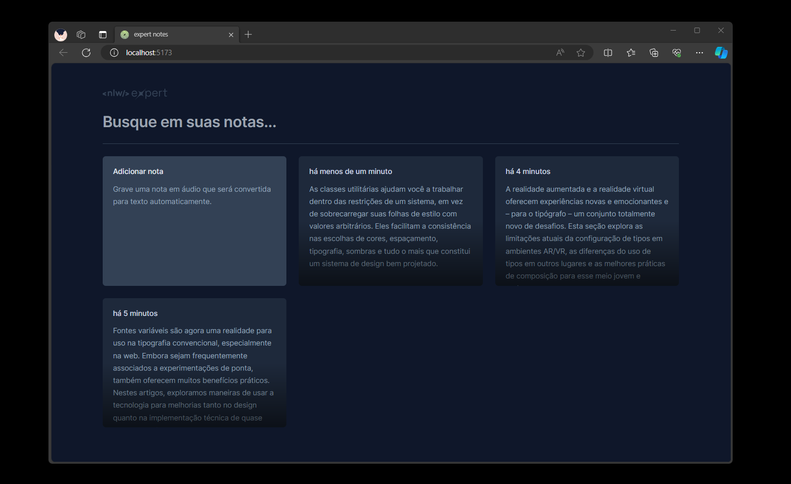

<h1 align="center"> NLW Expert Notes </h1>

Essa aplicação foi desenvolvida durante o NLW Experts da Rocketseat.  

 

  

 

## 🚀 Tecnologias

Esse projeto foi desenvolvido com as seguintes tecnologias:

- React
- TypeScript
- Tailwind
- SpeechRecognition API
- Figma

## 💻 Projeto

O NLW Expert Notes é um app para ajudar a registrar suas anotações. Você pode adicionar a nota gravando em áudio ou se preferir em texto.

- Executando
Após clonar o repositório, acesse a pasta do projeto e execute os comandos abaixo:

- npm install  
- npm run dev  

 

- Acesse http://localhost:5173 para visualizar a aplicação.

## 🔖 Layout

Você pode visualizar o layout do projeto através [DESSE LINK](https://www.figma.com/community/file/1336456128647909148). É necessário ter conta no [Figma](https://figma.com) para acessá-lo.

---

Feito com ♥ by Rocketseat :wave: [Participe da comunidade!](https://discord.gg/rocketseat)
